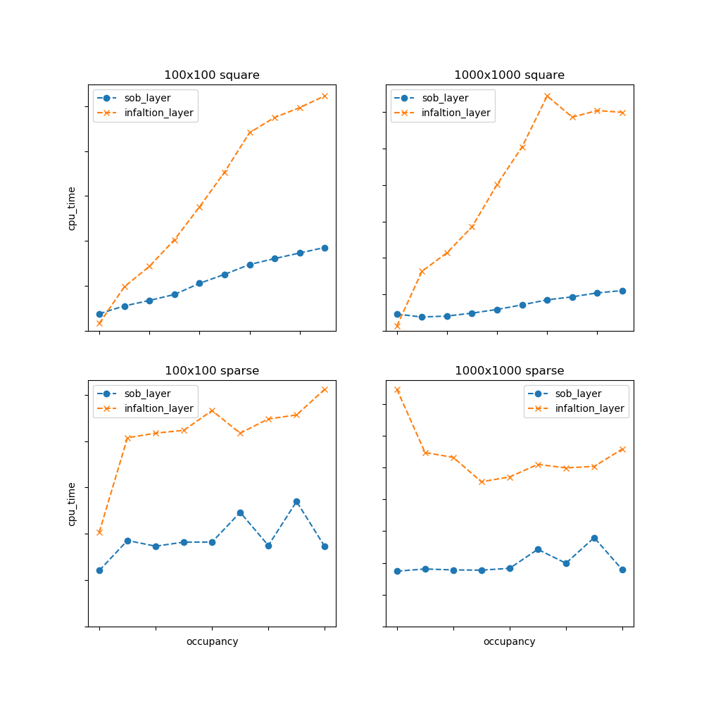

# Small-Objects-Big (Sob) Layer

[](https://travis-ci.com/dorezyuk/sob_layer)

The sob_layer provides a costmap_2d::Layer plugin for move_base (and all 
compatible frameworks). Its intention is to offer an alternative to the
commonly used [costmap_2d::InflationLayer](http://wiki.ros.org/costmap_2d/hydro/inflation).

## Build

The build process is the same as for every catkin-based package.
Assuming you are in our catkin_ws and have catkin-tools installed:

```
git clone https://github.com/dorezyuk/sob_layer.git && cd sob_layer
catkin build --this --no-deps --cmake-args -DCMAKE_BUILD_TYPE=Release
```

By default it will also try to build the benchmark target.
In order to run the benchmarks you will need to install the [benchmark](https://github.com/google/benchmark) library.
If you don't want to build the benchmark target, add
```
-Dsob_layer_BENCHMARK=OFF
```
to your build command. The benchmarking should help to figure you out, if the
sob_layer offers a reasonable improvement for your specific usecase/platform.

## Requirements

The library requires at least C++11. It has been tested on Ubuntu 18.04 running ros-melodic. Following compilers are known to work
* GCC 7.5.0
* Clang 6.0.0


## Benchmarks

This library was benchmarked against the costmap_2d::InflationLayer.
The benchmarks focus on two extreme scenarios. 

In the first scenario we measure the performance of large, connected obstacles.
We place a filled rectangle in the middle of the map.
The rectangle is set to the size NxN. N ranges from 0 to 0.9 times the overall map's
edge E (assuming the map has the size ExE). An increasing N increases hence the load-factor/occupancy.

In the second scenario we measure the performance of unconnected obstacles.
On an flattened map, we mark every N-th cell as occupied.
If N is the stride, then a decreasing stride
increases the load-factor/occupancy (more cells are marked as occupied).
The used stride-values are [101, 51, 41, 31, 21, 11, 6, 3, 2].



The image above shows the results. 
The results were obtained on a AMD Ryzen 5 PRO 4650U CPU.

The y-axis indicates the cpu_time. The
x-axis show the occupancy; The occupancy increases from left to right.
Both scenarios were run for two map-sizes: 100x100 and 1000x1000.
The upper row shows the results for the first scenario, the lower for the
second scenario.


## Config
